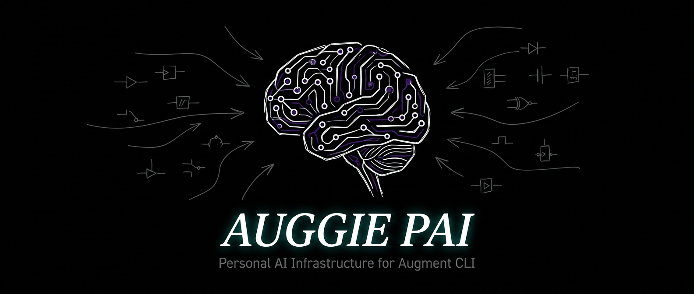
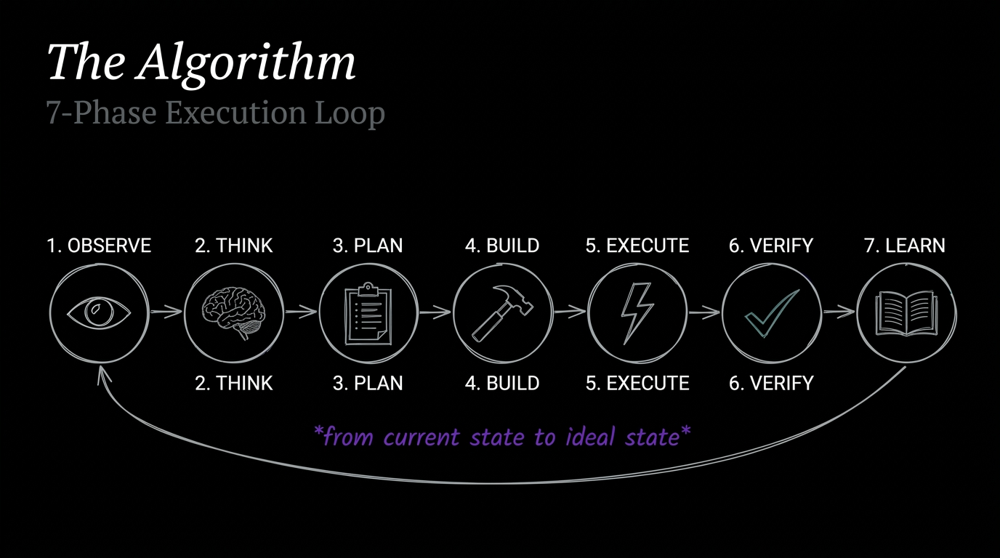
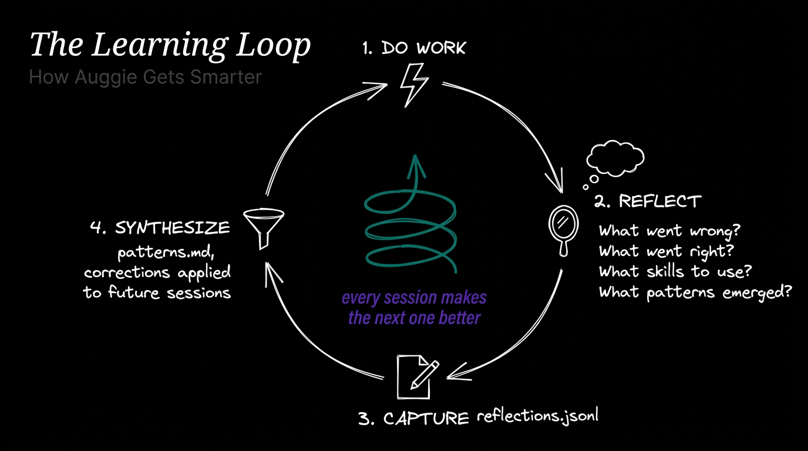
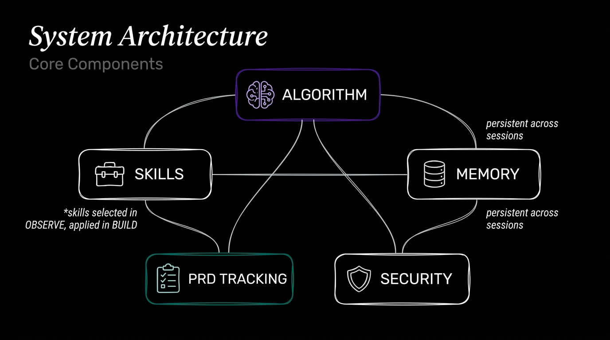
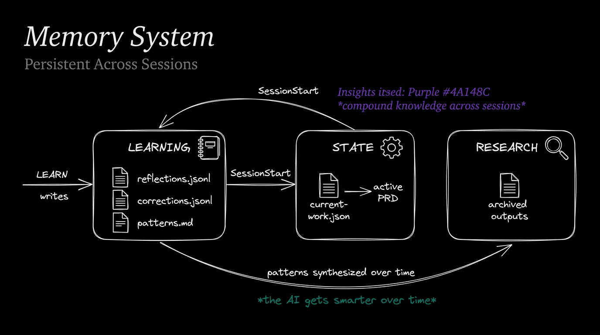
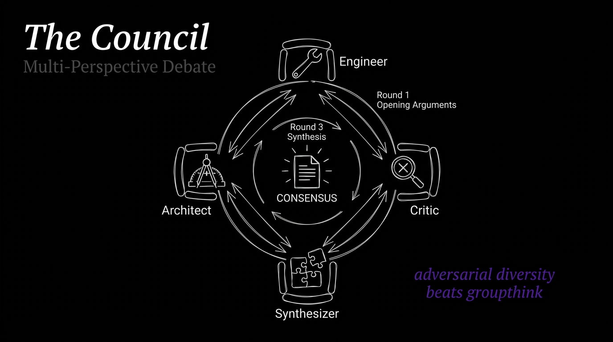

<p align="center">
  
</p>

<p align="center">
  <strong>Personal AI Infrastructure for Augment Code CLI</strong>
</p>

<p align="center">
  <a href="#the-algorithm">Algorithm</a> &bull;
  <a href="#system-architecture">Architecture</a> &bull;
  <a href="#skills">Skills</a> &bull;
  <a href="#installation">Installation</a> &bull;
  <a href="#customization">Customization</a>
</p>

---

## What is Auggie PAI?

An adaptation of Daniel Miessler's [PAI (Personal AI Infrastructure)](https://github.com/danielmiessler/PAI) for the **Augment Code CLI**.

PAI transforms AI coding assistants from stateless chat into a structured execution system with persistent memory, verifiable criteria, and repeatable methodology. Auggie PAI brings that same rigor to the Augment CLI environment.

**What you get:**
- A **7-phase Algorithm** that structures every non-trivial task
- **18 skills** across thinking, research, security, and personas
- **Persistent memory** that learns from every session
- **ISC (Ideal State Criteria)** — atomic, binary-testable criteria that define "done"
- **PRD tracking** — structured work artifacts that survive context loss

---

## The Algorithm

<p align="center">
  
</p>

The Algorithm is PAI's core execution engine. Every non-trivial request flows through 7 phases:

| Phase | What Happens |
|-------|-------------|
| **OBSERVE** | Reverse-engineer the request. Extract explicit wants, implied wants, what's NOT wanted. Generate ISC criteria. Select capabilities. |
| **THINK** | Pressure test. Premortem. Identify riskiest assumptions. Refine criteria through the Splitting Test. |
| **PLAN** | Validate prerequisites. Create execution plan. File-edit manifest for multi-file work. |
| **BUILD** | Create artifacts. Invoke each selected capability. Constraint checkpoint after each artifact. |
| **EXECUTE** | Run the work. Continuously verify against criteria — don't batch to end. Mark PRD checkboxes as criteria pass. |
| **VERIFY** | Mechanical verification of every criterion. No rubber-stamping. Specific evidence required. |
| **LEARN** | Reflect. Capture patterns. Write to persistent memory for future sessions. |

<p align="center">
  
</p>

### Mode Selection

Not everything needs the full Algorithm:

| Mode | When | Example |
|------|------|---------|
| **MINIMAL** | Greetings, acknowledgments | "hello", "thanks" |
| **NATIVE** | Quick tasks under 2 minutes | "what's 2+2", "rename this var" |
| **ALGORITHM** | Everything non-trivial | "build a caching layer", "debug this auth flow" |

### Effort Levels

The Algorithm scales to match the task:

| Tier | Time Budget | ISC Criteria | Min Skills |
|------|------------|-------------|-----------|
| Standard | <2 min | 8–16 | 1–2 |
| Extended | <8 min | 16–32 | 3–5 |
| Advanced | <16 min | 24–48 | 4–7 |
| Deep | <32 min | 40–80 | 6–10 |
| Comprehensive | <2 hrs | 64–150 | 8–15 |

### ISC — Ideal State Criteria

The secret sauce. Every task is decomposed into **atomic, binary-testable criteria** before any work begins.

Each criterion must pass the **Splitting Test**:
1. **"And"/"With" test** — joining two verifiable things? Split.
2. **Independent failure test** — can part A pass while B fails? Split.
3. **Scope word test** — "all", "every", "complete"? Enumerate what "all" means.
4. **Domain boundary test** — crosses UI/API/data boundaries? One criterion per boundary.

```
Bad:  "Blog publishing handles draft to published with SEO metadata"
Good: "Draft status stored in frontmatter YAML field"
      "Published timestamp set on first publish only"
      "Meta description under 160 characters"
      "Canonical URL set to published permalink"
```

---

## System Architecture

<p align="center">
  
</p>

### Five Core Components

**Algorithm** (`rules/algorithm.md`) — The 7-phase execution loop. Injected into every prompt via `alwaysApply: true` frontmatter. This is the brain.

**Skills** (`skills/`) — 18 self-contained methodologies the Algorithm can invoke during BUILD/EXECUTE. Each has a `SKILL.md` defining triggers, methodology, and output format.

**Memory** (`MEMORY/`) — Persistent across sessions. Reflections from LEARN phases, user corrections, synthesized patterns, and active work state.

<p align="center">
  
</p>

**PRD Tracking** (`.prd/`) — Product Requirements Documents created during ALGORITHM mode. YAML frontmatter tracks phase, progress, effort. ISC criteria live as checkboxes. Survives context loss.

**Security** (`rules/security.md`) — Prompt injection defense, credential handling, SSRF awareness, destructive operation guards.

---

## Skills

### Thinking
| Skill | What It Does |
|-------|-------------|
| `first-principles` | Deconstruct → Challenge assumptions → Reconstruct from ground truth |
| `council` | Multi-perspective debate with 3 rounds of deliberation (see below) |
| `red-team` | Adversarial analysis — steelman then attack |
| `iterative-depth` | Multi-angle exploration through cognitive lenses |
| `science` | Hypothesis-driven investigation with experiment design |

<p align="center">
  
</p>

### Research
| Skill | What It Does |
|-------|-------------|
| `quick-research` | Rapid research pass |
| `standard-research` | In-depth multi-source research |
| `deep-investigation` | Comprehensive investigation |
| `extract-knowledge` | Structured knowledge extraction |
| `extract-wisdom` | Wisdom and insight extraction |

### Security
| Skill | What It Does |
|-------|-------------|
| `recon` | Network and domain reconnaissance |
| `web-assessment` | OWASP-style web application security |
| `threat-model` | Threat modeling and risk analysis |
| `prompt-injection` | LLM prompt injection testing |

### Agent Personas
| Persona | Identity | Specialty |
|---------|----------|-----------|
| `engineer` | Marcus Webb | Implementation, debugging, optimization |
| `architect` | Serena Blackwood | System design, patterns, trade-offs |
| `qa-tester` | Quinn Torres | Testing, edge cases, quality gates |
| `pentester` | Rook Blackburn | Offensive security, vulnerability assessment |

---

## Slash Commands

```
/think <skill> <topic>      Apply a thinking methodology
/research <mode> <topic>     Run research (quick/standard/deep/extract)
/assess <type> <target>      Security assessment
/agent <persona> <task>      Adopt an agent persona
/memory <operation>          Memory operations (read/status/reflect)
/status                      Show PAI system status
```

---

## Installation

### 1. Clone

```bash
# Back up existing config if you have one
[ -d ~/.augment ] && mv ~/.augment ~/.augment.backup

git clone https://github.com/jwm-axoni/auggie-pai.git ~/.augment
```

### 2. Setup

```bash
cd ~/.augment && ./setup.sh
```

### 3. Configure

Edit these files with your details:

| File | Purpose |
|------|---------|
| `settings.json` | MCP servers, credentials, indexing paths |
| `USER/ABOUTME.md` | Your role, expertise, timezone |
| `USER/AISTEERINGRULES.md` | AI behavior preferences |
| `USER/WORK/AXONIUS.md` | Company context (rename to your company) |
| `USER/WORK/PROJECTS.md` | Active project registry |

### 4. Use

Launch Augment CLI. The Algorithm loads automatically. Type naturally — mode selection happens automatically.

---

## Directory Structure

```
~/.augment/
├── rules/                       # Always-injected rules
│   ├── algorithm.md             # The Algorithm v3.0-auggie
│   ├── security.md              # Security guidelines
│   └── context-routing.md       # Topic → file routing
│
├── skills/                      # 18 invocable skills
│   ├── first-principles/        # Thinking skills
│   ├── council/
│   ├── red-team/
│   ├── engineer/                # Agent personas
│   ├── architect/
│   ├── quick-research/          # Research skills
│   ├── recon/                   # Security skills
│   └── ...
│
├── commands/                    # /slash command definitions
│
├── USER/                        # Your configuration
│   ├── ABOUTME.md
│   ├── AISTEERINGRULES.md
│   └── WORK/
│
├── MEMORY/                      # Persistent memory
│   ├── LEARNING/                # Reflections, corrections, patterns
│   ├── STATE/                   # Active work pointer
│   └── RESEARCH/                # Research archives
│
└── .prd/                        # PRD work tracking
    └── templates/
```

---

## Customization

### Add a Skill

```bash
mkdir -p ~/.augment/skills/my-skill
```

Create `SKILL.md`:
```yaml
---
name: my-skill
description: Short description. USE WHEN trigger words go here.
---

# My Skill

## Methodology
1. Step one
2. Step two
3. Step three
```

### Add a Slash Command

Create `commands/my-command.md`:
```yaml
---
description: What this command does
argument-hint: "<arg1> <arg2>"
---

Instructions for the AI when this command is invoked.
```

### Tune AI Behavior

Edit `USER/AISTEERINGRULES.md` to adjust response style, technical preferences, and operational boundaries.

---

## How It Compares

| Feature | Vanilla Augment CLI | With Auggie PAI |
|---------|-------------------|-----------------|
| Task structure | Freeform | 7-phase Algorithm with ISC |
| Memory | None between sessions | Reflections, patterns, corrections |
| Skills | Generic capabilities | 18 specialized methodologies |
| Work tracking | None | PRD with YAML frontmatter + criteria checkboxes |
| Security | Basic | Prompt injection defense, credential guards, SSRF awareness |
| Quality gates | None | Mechanical verification, anti-criteria, Splitting Test |

---

## Credits

- **PAI**: [Daniel Miessler](https://github.com/danielmiessler/PAI)
- **The Algorithm**: [github.com/danielmiessler/TheAlgorithm](https://github.com/danielmiessler/TheAlgorithm)
- **Augment CLI**: [augmentcode.com](https://augmentcode.com)

---

<p align="center">
  <em>AI should magnify everyone — not just the top 1%.</em>
</p>
